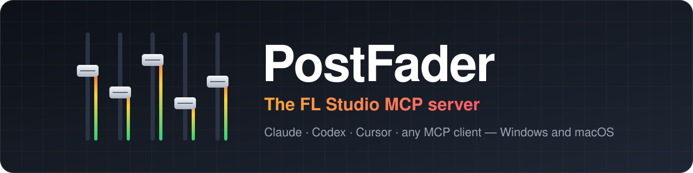
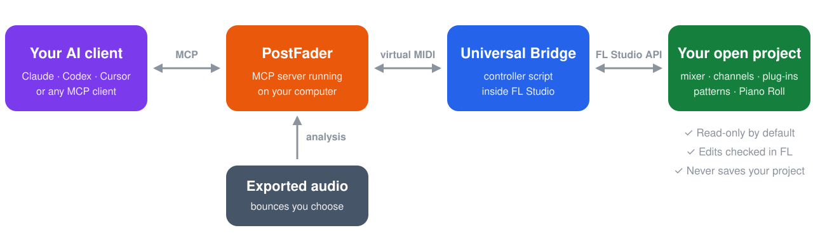

# PostFader: FL Studio MCP Server

**Let Claude, Codex, Cursor, or any MCP client work inside the FL Studio project you have open.**

[Quick start](#quick-start) · [What it does](#what-you-can-ask-for) · [Why PostFader](#why-postfader) · [Docs](#documentation) · [FAQ](#faq)

Free and open source. Unofficial: not made by or affiliated with Image-Line.

---

PostFader is an **FL Studio MCP server**. It connects your AI assistant to the
project you already have open, so the AI can read your mixer, channels,
plug-ins and patterns, check your exported mix, write MIDI, and make changes
for you. Every supported change is read back from FL Studio, so you see what
actually happened.

It runs on your computer. There is no PostFader account, cloud service, or
telemetry.

## What you can ask for

| | Ask your AI | What PostFader does |
| --- | --- | --- |
| 🔎 **Understand a project** | *"Which instruments aren't routed to the mixer?"* | Reads routing, effects, channels, patterns, Playlist tracks, and plug-in parameters. |
| 🩺 **Fix a mix** | *"What are the three biggest problems in this bounce?"* | Measures loudness, peaks, tonal balance, stereo width, and vocal masking in the files you export, and compares them with a reference. |
| 🎛️ **Change the session** | *"Pan the backing vocals wider and pull the reverb send down 3 dB."* | Sets faders, pan, sends, routing, names, colors, tempo, transport, and any parameter a loaded plug-in exposes, then reads each one back. |
| 🎹 **Write music** | *"Add an 8-bar D Dorian bassline under my chords."* | Generates chords, melodies, basslines, and drums; writes them to the Piano Roll or exports MIDI files. |
| 🎚️ **Pick sounds** | *"Choose the sounds yourself from what's loaded."* | Picks presets on the instruments in your project and confirms each selection. |
| 🧱 **Run a whole task** | *"Turn this loop into a 16-bar draft, but keep my vocal."* | Runs the job as a checked plan you can resume. Export a bounce and it can review the draft and plan one revision. |

Browse all 85 tools in the [tool reference](docs/tools.md).

## Quick start

**You need:** FL Studio 2026 (26.1.3 or newer) on Windows or macOS,
[Python](https://www.python.org/downloads/) 3.10 to 3.14, and a virtual MIDI
port: the built-in **IAC Driver** on macOS, or a free app such as **loopMIDI**
on Windows.

1. **Run the installer.** Download the Windows or macOS ZIP from the
   [latest release](https://github.com/synopsys0/postfader-fl-studio-mcp/releases/latest), extract it, and run the installer inside. It
   installs PostFader, copies the bridge script into FL Studio, and asks which
   MIDI port to use.
2. **In FL Studio**, open *Options → MIDI settings*. Enable your virtual port as
   both input and output, set the input's controller type to
   **Universal Bridge**, and give both the same port number.
3. **Connect your AI client** with the configuration the installer prints (see
   [Works with](#works-with)).
4. **Ask a question first**, like *"Summarize my project."* PostFader starts
   read-only, so nothing changes until you ask for an edit.

Using Python directly? Run `pip install postfader-fl-studio-mcp`, then
`postfader setup`. The [setup guide](docs/setup.md) covers every option, and
`postfader-doctor` pinpoints anything that isn't connected.

## How it works

FL Studio only runs scripts from inside itself, so PostFader talks to a small
controller script, the **Universal Bridge**, over a virtual MIDI port. Audio
analysis works on files you export, because FL Studio doesn't expose its live
output to scripts.

## Why PostFader

- **Nothing changes until you ask.** PostFader starts read-only. Edits need
  write mode, which the AI turns on for your session only when you ask for a
  change. Reloading the project turns it off again.
- **Changes are checked, not assumed.** After each supported edit, PostFader
  reads the value back from FL Studio and reports what actually happened.
- **Your project is never saved for you.** You decide when to save, and FL
  Studio's undo history keeps working.
- **It checks your mix, not just your settings.** Mix Doctor, loudness and
  true-peak checks, reference comparison, and vocal masking run on the bounces
  you choose.
- **It doesn't crowd your AI's context.** Detailed plan formats load only when
  the AI needs them, leaving room for your conversation.
- **Windows and macOS, tested on both.** Every change runs the full test suite
  on both systems before release.

[See how PostFader compares with other FL Studio MCP servers →](docs/comparison.md)

## Works with

PostFader is a local MCP server, so your AI client must run on the same
computer as FL Studio. `postfader setup` prints ready-to-paste configuration.

| Client | How to connect |
| --- | --- |
| **Claude Desktop** | Paste the generated `claude-json` config, or install the `.mcpb` extension from the release page. |
| **Claude Code** | `claude mcp add-json fl-studio '<the fl-studio entry from claude-json>'` |
| **Codex** (CLI, IDE, app) | Run the Codex installer ZIP, or `postfader setup --client codex-toml --register-codex`. |
| **Cursor** | Paste the `claude-json` entry into `~/.cursor/mcp.json`. |
| **Other MCP clients** | Any client that can launch a local stdio server. Use the same command, arguments, and environment. |

## Documentation

| Guide | What's in it |
| --- | --- |
| [Setup and troubleshooting](docs/setup.md) | Installers, MIDI settings, every client, upgrades, and the doctor |
| [Tool reference](docs/tools.md) | All 85 tools and 8 resources, grouped by task |
| [FAQ](docs/faq.md) | Short answers to common questions and problems |
| [Comparison](docs/comparison.md) | PostFader next to other FL Studio MCP servers and Gopher |
| [Production Runs](docs/production-runs.md) | Multi-step jobs, resuming, and stopping |
| [Creation Review](docs/creation-review.md) | Reviewing a draft bounce, revising it, and preparing delivery |
| [Sound Selection](docs/sound-selection.md) | How PostFader picks presets from loaded instruments |
| [Plug-in support](docs/plugin-support.md) | Parameter control, presets, and compatibility reports |
| [FL Studio limits](docs/fl-constraints.md) | What FL Studio's scripting API can't do |
| [Security and privacy](SECURITY.md) | What runs where, and how to report a vulnerability |
| [All documentation](docs/README.md) | Architecture, contracts, release notes, and more |

## FAQ

### What is an FL Studio MCP server?

MCP (Model Context Protocol) is the open standard AI assistants use to call
tools. An FL Studio MCP server gives the assistant tools for FL Studio, so it
can read and change your project instead of only describing what to click.

### Which FL Studio versions work?

FL Studio 2026, version 26.1.3 build 5336 or newer. Older builds are refused
because they lack MIDI-scripting fixes PostFader relies on.

### Do I need loopMIDI?

On Windows you need one virtual MIDI port; loopMIDI is a common free choice.
On macOS, enable the built-in IAC Driver in Audio MIDI Setup.

### Can it hear my song?

It analyzes audio files you export. FL Studio doesn't give scripts access to
its live output, so PostFader can't listen in real time.

### Can it load plug-ins?

On macOS, yes: it adds instruments and effects from FL Studio's Add menu
(this needs Accessibility access). On Windows, load them yourself; PostFader
can then control their parameters.

### Will it mess up my project?

It starts read-only, checks every supported change, and never saves. Use FL
Studio's undo if you don't like an edit, and try your first edits on a copy.

More in the [FAQ](docs/faq.md).

## Contributing and security

Bug reports, plug-in compatibility results, and pull requests are welcome; see
[CONTRIBUTING.md](CONTRIBUTING.md) and
[GitHub Discussions](https://github.com/synopsys0/postfader-fl-studio-mcp/discussions).
Report vulnerabilities privately as described in [SECURITY.md](SECURITY.md).

PostFader is licensed under the [Apache License 2.0](LICENSE). FL Studio is a
trademark of Image-Line, which does not make or endorse this project.

<!-- mcp-name: io.github.synopsys0/postfader-fl-studio-mcp -->
